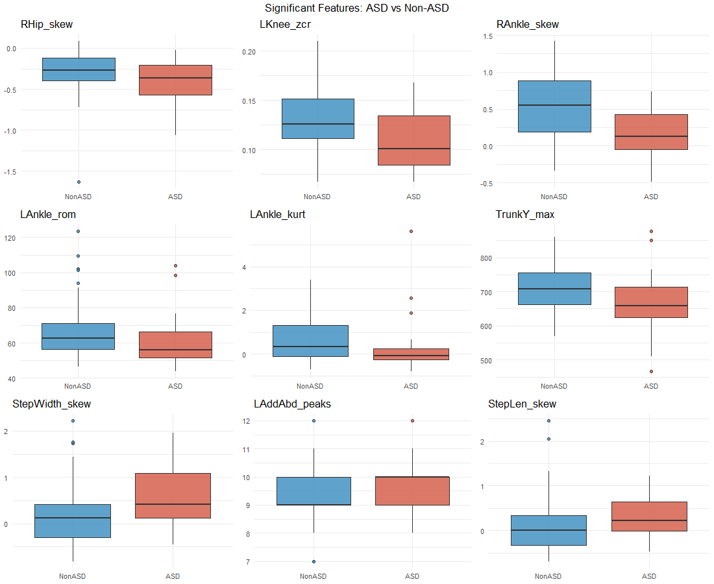
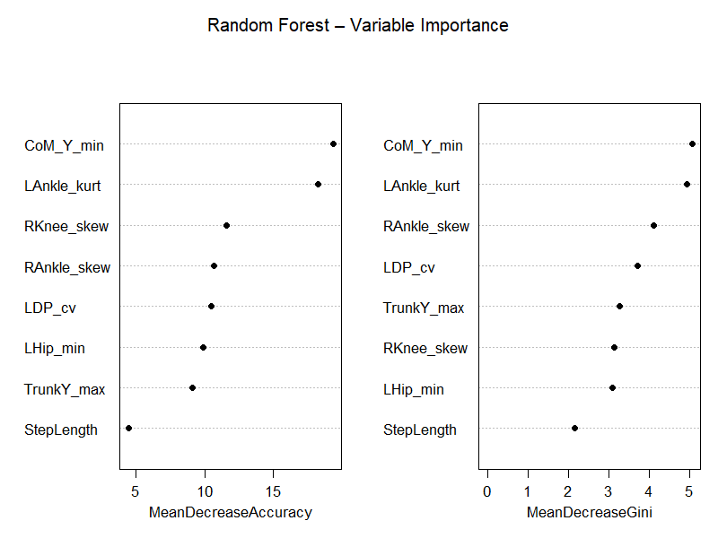
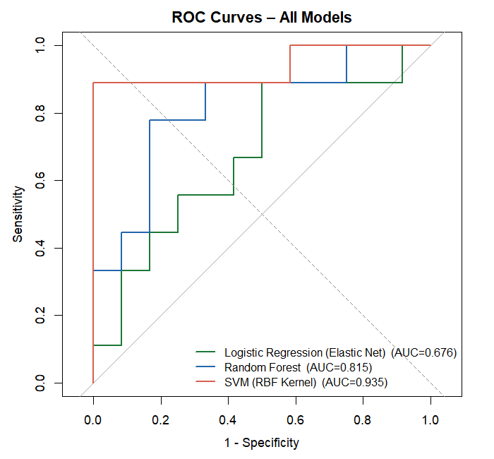
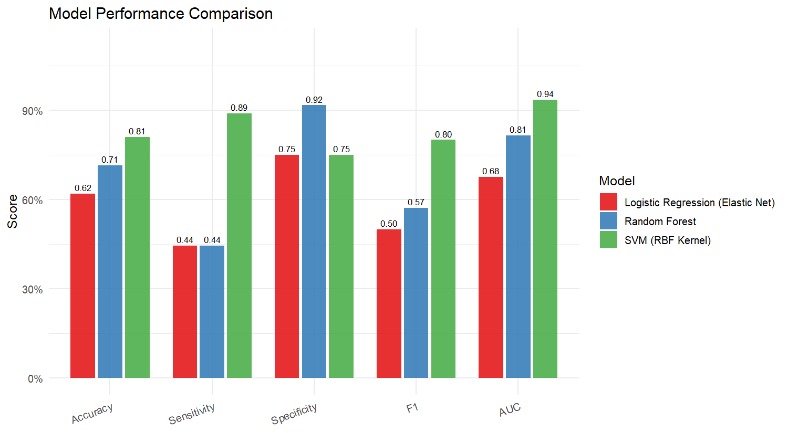
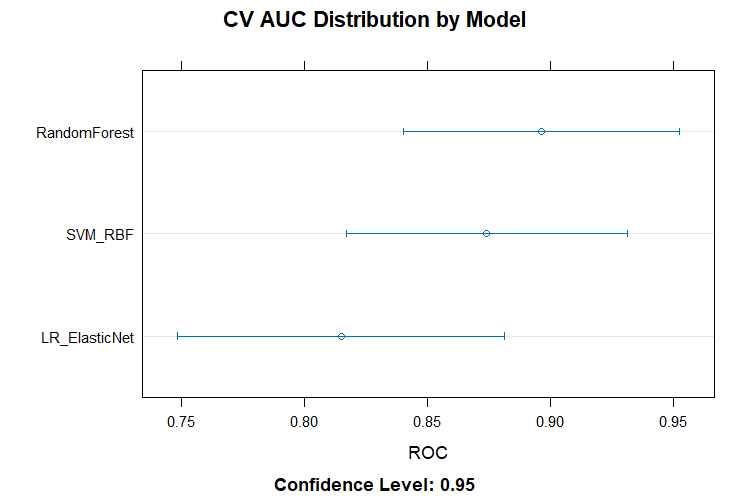

# iGAIT — Traditional ML Pipeline for ASD Gait Classification

This repository contains the full machine learning pipeline developed for classifying **Autism Spectrum Disorder (ASD) vs. typically developing (TD) children** from markerless gait data captured via video keypoint tracking. The pipeline covers everything from raw keypoint time-series to feature extraction, statistical testing, model training, and evaluation with proper confidence intervals.

---

## Project Overview

Gait analysis is a promising, non-invasive avenue for ASD screening. This project uses **pose estimation keypoints** (from side and front camera views) to extract rich biomechanical features per subject, then applies traditional ML classifiers — Logistic Regression, Random Forest, and SVM — to distinguish ASD from non-ASD walking patterns.

Key design choices:
- SMOTE is applied **only to the training set** to handle class imbalance
- All scaling is fit on training data only (no data leakage)
- Confidence intervals use **Wilson CI** for proportions and **DeLong CI** for AUC
- Feature selection uses Boruta (Random Forest wrapper) rather than manual picking

---

## Pipeline

```
Side + Front Keypoint CSVs
        ↓
extract_rich_features.py   →   gait_features_rich.csv
        ↓
thesis.R / paper_subject_level_prediction.R
  ├── NZV + Correlation Filtering
  ├── Shapiro-Wilk → t-test / Wilcoxon
  ├── Boruta Feature Selection
  ├── 70/30 Stratified Split
  ├── SMOTE (train only) + StandardScaler
  └── Train & Evaluate: LR, RF, SVM (+ XGBoost optional)
        ↓
Plots, CSVs, Subject-level Predictions
```

---

## File Descriptions

### `extract_rich_features.py`
Reads side-view and front-view keypoint CSVs and computes a rich feature set per subject. For each joint angle signal (hip, knee, ankle, dorsiplantar, adduction/abduction) it extracts: mean, std, min, max, ROM, CV, skewness, kurtosis, peak count, trough count, and zero-crossing rate. It also computes symmetry indices (left vs. right), step width, step/stride length, cadence, and vertical CoM oscillation. Outputs `gait_features_rich.csv`.

### `thesis.R`
The core ML script. Loads the feature CSV, removes near-zero-variance and highly correlated features (r > 0.95), runs Shapiro-Wilk–guided group tests to find significant features, runs Boruta for final feature selection, then trains Logistic Regression (elastic net), Random Forest, SVM (RBF), and optionally XGBoost. Uses 5-fold repeated cross-validation, SMOTE on the training set, and reports accuracy, sensitivity, specificity, F1, and AUC on the held-out test set. Saves all plots and model comparison results.

### `paper_subject_level_prediction.R`
A cleaner version of `thesis.R` extended for the paper. The key addition is that **subject IDs are tracked through the split**, so each model's predictions are saved per-subject (true label, predicted label, ASD probability, correct/incorrect). This makes it possible to audit individual misclassifications, which is important when the test set has only ~21 subjects.

### `class differentiation.R`
Standalone group comparison script. Takes the 10 statistically significant features and computes group means ± SD for ASD vs. non-ASD. Picks the right effect size automatically — Cohen's d for normally distributed features (Shapiro p > 0.05), rank-biserial r via Wilcoxon otherwise. Also isolates `CoM_Y_min` specifically to report observed min/max by group, supporting the interpretation that ASD children show lower and more variable centre-of-mass positions during walking.

### `wilson_and_delong_imp.R`
Implements Wilson confidence intervals for accuracy, sensitivity, and specificity, and DeLong confidence intervals for AUC. Wilson CI is preferred over the normal approximation when proportions are near 0 or 1 or sample sizes are small (both apply here with ~21 test subjects). DeLong CI treats AUC as a U-statistic and estimates its variance analytically from predicted probability ranks — no bootstrapping needed, and it handles correlated ROC curves across models correctly.

### `boruta_distribution.R`
A reviewer utility. Runs Boruta across five different random seeds to check whether the selected features are stable or seed-dependent. Helps report that the feature selection is reproducible rather than a one-off artifact of a lucky seed.

---

## Outputs

| File | Description |
|---|---|
| `gait_features_rich.csv` | Extracted features — one row per subject |
| `model_comparison_results.csv` | Accuracy, sensitivity, specificity, F1, AUC for all models |
| `predictions_*.csv` | Subject-level predictions for each model (LR, RF, SVM) |

---

## Plots

### Significant Features — ASD vs. Non-ASD
Boxplots of the features that passed the group comparison test (p < 0.05).



---

### Random Forest — Variable Importance
Which features the final Random Forest relies on most (MeanDecreaseAccuracy and MeanDecreaseGini).



---

### ROC Curves — All Models
Overlaid ROC curves for LR, RF, and SVM on the held-out test set.



---

### Model Performance Comparison
Side-by-side bar chart of all metrics across classifiers.



---

### Cross-Validation AUC Distribution
Dotplot of AUC across the 5×3 repeated CV folds — shows variance, not just mean performance.



---

## Requirements

**Python**
```
numpy, pandas, scipy
```

**R packages**
```r
caret, pROC, ggplot2, dplyr, corrplot, randomForest,
e1071, xgboost, glmnet, gridExtra, RColorBrewer,
scales, reshape2, themis, Boruta, doParallel, recipes,
effsize, rstatix
```

---

## Notes on Confidence Intervals

**Wilson CI** is used for accuracy, sensitivity, and specificity because these are proportions computed from a small sample (~21 test subjects). The standard normal approximation breaks down near 0 or 1; Wilson stays calibrated.

**DeLong CI** is used for AUC. AUC is not a simple proportion — it is estimated from the full ROC curve and treated as a U-statistic. DeLong estimates its variance analytically from predicted probability ranks, which is the standard approach in clinical ML papers.

---

## Author

Prashanna Raj Pandit · NIU-AI-LEADS
